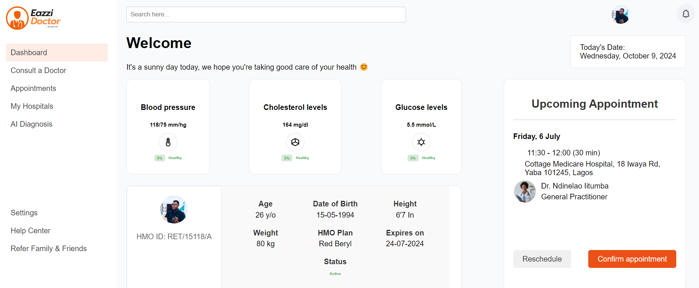

# Eazzi Doc Telemedicine Dashboard



## Introduction

### Purpose

The Eazzi Doc Telemedicine Dashboard web app is designed to enhance healthcare accessibility across underserved regions by providing a platform where patients and healthcare providers can engage in remote medical consultations and services. This user-friendly dashboard facilitates online appointments, medical consultations, and health monitoring, and AI diagnosis aiming to bridge the healthcare service gap in regions with geographical barriers, limited medical personnel, and infrastructure constraints.

### Product Scope

The Eazzi Doc Telemedicine Dashboard is crafted to improve healthcare access, focusing on underserved communities in Africa. It enables real-time communication, health data management, and online appointment scheduling, ultimately contributing to improved health outcomes and community development.

## Features

- **User Registration and Authentication**: Secure login, email verification, and password management.
- **Intuitive User Interface**: Easy navigation and compliance with WCAG accessibility standards.
- **Appointment Scheduling**: Online booking, rescheduling, and cancellation of appointments.
- **Provider Availability Management**: Providers can update their available times for consultations.
- **Online Consultations**: Schedule and review past consultations.
- **Notifications and Alerts**: System notifications for appointments, health checks, and customizable alerts.
- **Geolocation Services**: Location-based services to recommend nearby healthcare facilities.
- **AI Diagnosis**: Automated AI diagnosis for ocular diseases

## Technologies Used

- **Frontend**: HTML, CSS and Vanilla JavaScript.
- **Backend**: Postgres, Flask
- **Database**: Postgres sql database,
- **Trained AI model with OpenAI API**: DenseNet201 model and gpt-4 api
- **APIs**: supacbase API for client-server communication

## Installation

```bash
git clone https://github.com/Makuo67/iCatch.git
cd iCatch
go live
```

## Usage

```bash
# Sign up with credential as a first user.
# Login with credentials to access the dashboard.
# Navigate through the dashboard to book appointments, book consultation, view health stats, do the AI Diagnosis, or locate hospitals.
```

## Deployment

- The application will be deployed on render in no distant time

## Video Demo

[](https://youtu.be/YMNOptAKmvs)

## Kaggle Notebook
[Kaggle](https://www.kaggle.com/code/okekemakuochukwu/capstone1)


## Contributing

Contributions are welcome! For major changes, please open an issue first to discuss what you would like to change. Please ensure to update tests as appropriate.

## License

This project is licensed under the MIT License - see the LICENSE.md file for details.

## Contact

- **Email**: m.okeke@alustudent.com
- **Phone**: + 250790801063

---
